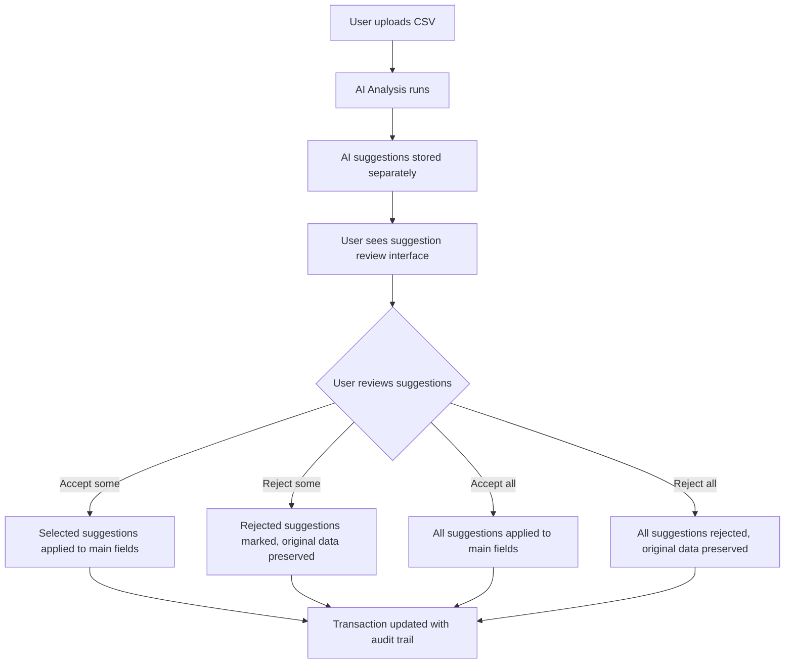

# AI Suggestion Review System

## Overview

The AI Suggestion Review System is a user-centric approach to AI-powered transaction analysis that **preserves user data integrity** while providing intelligent suggestions that users can selectively accept or reject.

## 🎯 Key Principles

### 1. **Non-Destructive AI Analysis**
- AI suggestions are stored in **separate database fields**
- User's original data is **never overwritten** during analysis
- Users maintain **full control** over their data

### 2. **Selective Acceptance**
- Users can **accept individual suggestions** (e.g., just the category, not the tax status)
- Users can **reject specific suggestions** while keeping others
- Users can **accept all** or **reject all** suggestions for a transaction

### 3. **Audit Trail**
- Complete **tracking of user decisions** (accepted/rejected suggestions)
- **Timestamps** for when suggestions were reviewed
- **Status tracking** for each transaction's suggestion state

## 🏗️ Architecture

### Database Schema

```sql
-- AI Suggestions (separate from user data)
aiSuggestedCategory           String?  -- AI-suggested category
aiSuggestedTaxDeductible      Boolean? -- AI tax deductibility suggestion
aiSuggestedBusinessPercentage Int?     -- AI business use percentage
aiSuggestedClassification     String?  -- AI classification (Income/Expense/Transfer)
aiSuggestedSubType           String?  -- AI sub-type (bill/one-time/capital)
aiSuggestedRecurring         Boolean? -- AI recurring pattern detection
aiSuggestedMerchant          String?  -- AI merchant name cleanup

-- User Decision Tracking
userReviewedAI               Boolean  -- Whether user reviewed suggestions
userAcceptedSuggestions      String?  -- JSON array of accepted suggestions
userRejectedSuggestions      String?  -- JSON array of rejected suggestions
aiReviewedAt                 DateTime? -- When user reviewed suggestions
aiSuggestionStatus           String   -- "pending", "reviewed", "partially_accepted", "all_accepted", "all_rejected"
```

### Workflow



## 🔧 Implementation

### Frontend Components

#### 1. **DataBucketCard.tsx**
- **Review AI Suggestions** button added to each data bucket
- Integration with `AISuggestionReview` component
- Handlers for accept/reject actions

#### 2. **AISuggestionReview.tsx**
- **Expandable accordion** for each transaction with suggestions
- **Individual suggestion selection** with confidence indicators
- **Batch actions** (Accept All, Reject All, Accept Selected, Reject Selected)
- **Visual indicators** for suggestion types and confidence levels

### Backend API Endpoints

#### 1. **POST /api/databuckets/:uploadId/analyze**
- Stores AI suggestions in separate fields
- Sets `aiSuggestionStatus` to "pending"
- Preserves original user data

#### 2. **POST /api/databuckets/suggestions/:transactionId/accept**
- Accepts specific suggestions for a transaction
- Updates main fields with accepted suggestions
- Tracks accepted suggestions in audit trail

#### 3. **POST /api/databuckets/suggestions/:transactionId/reject**
- Rejects specific suggestions for a transaction
- Preserves original data, marks suggestions as rejected
- Tracks rejected suggestions in audit trail

#### 4. **POST /api/databuckets/suggestions/:transactionId/accept-all**
- Accepts all available suggestions for a transaction
- Updates all applicable main fields
- Sets status to "all_accepted"

#### 5. **POST /api/databuckets/suggestions/:transactionId/reject-all**
- Rejects all available suggestions for a transaction
- Preserves all original data
- Sets status to "all_rejected"

## 🎨 User Experience

### 1. **AI Analysis Phase**
```
1. User clicks "Run AI Analysis"
2. AI analyzes transactions
3. Suggestions stored separately
4. User notified analysis is complete
```

### 2. **Review Phase**
```
1. User clicks "Review AI Suggestions"
2. Dialog opens with suggestions for each transaction
3. User sees:
   - Current value vs. AI suggested value
   - Confidence level for each suggestion
   - Ability to select individual suggestions
4. User can:
   - Accept individual suggestions
   - Reject individual suggestions
   - Accept all suggestions for a transaction
   - Reject all suggestions for a transaction
```

### 3. **Suggestion Types**

| Type | Description | Example |
|------|-------------|---------|
| **Category** | AI-suggested transaction category | "Food & Dining" → "Business Meals" |
| **Tax Deductible** | AI assessment of tax deductibility | "No" → "Yes" |
| **Business %** | AI-calculated business use percentage | "0%" → "75%" |
| **Classification** | Primary type classification | "Expense" → "Income" |
| **Sub-Type** | Secondary classification for expenses | "One-time" → "Bill" |
| **Recurring** | Recurring pattern detection | "No" → "Yes (Monthly)" |
| **Merchant** | Cleaned-up merchant name | "AMZN MKTP*" → "Amazon" |

## 📊 Benefits

### For Users
- **Data Safety**: Original data never lost or overwritten
- **Control**: Choose which suggestions to accept
- **Transparency**: See AI confidence levels and reasoning
- **Efficiency**: Batch accept/reject options for speed

### For Developers
- **Audit Trail**: Complete history of user decisions
- **Flexibility**: Easy to add new suggestion types
- **Performance**: Selective updates reduce database load
- **Scalability**: Stateless API design

## 🔄 Migration Path

### Phase 1: Data Preservation (✅ Complete)
- Updated database schema with separate AI fields
- Modified analysis endpoint to preserve original data
- Created suggestion review API endpoints

### Phase 2: User Interface (✅ Complete)
- Built `AISuggestionReview` component
- Integrated with `DataBucketCard`
- Added review workflow to main app

### Phase 3: Enhancement (Future)
- Add suggestion explanations/reasoning
- Implement suggestion learning from user feedback
- Add batch review for multiple transactions
- Create suggestion analytics dashboard

## 🚀 Usage Example

```typescript
// User uploads CSV with 100 transactions
// AI analysis runs and creates suggestions for all transactions

// User reviews suggestions:
const suggestions = {
  "txn_123": {
    category: { current: "Uncategorized", suggested: "Food & Dining", confidence: 0.95 },
    taxDeductible: { current: false, suggested: true, confidence: 0.78 },
    businessPercentage: { current: 0, suggested: 50, confidence: 0.82 }
  }
};

// User accepts category and business percentage, rejects tax deductible
acceptSuggestions("txn_123", ["category", "businessPercentage"]);

// Result: Transaction updated with:
// - category: "Food & Dining" (accepted)
// - businessUsePercentage: 50 (accepted)
// - isTaxDeductible: false (original value preserved)
// - userAcceptedSuggestions: ["category", "businessPercentage"]
// - userRejectedSuggestions: ["taxDeductible"]
```

## 🛡️ Data Safety Features

1. **Separate Storage**: AI suggestions never overwrite user data
2. **Atomic Updates**: Accept/reject operations are transactional
3. **Rollback Capability**: Can revert to original data if needed
4. **Audit Trail**: Complete history of all user decisions
5. **User Control**: Users can always override AI suggestions

## 🎯 Success Metrics

- **Adoption Rate**: % of users who review AI suggestions
- **Acceptance Rate**: % of suggestions accepted by users
- **Confidence Correlation**: Relationship between AI confidence and user acceptance
- **Time Savings**: Reduction in manual categorization time
- **Accuracy Improvement**: Improvement in data quality post-AI analysis

This system provides the perfect balance between AI assistance and user control, ensuring data integrity while delivering intelligent automation. 