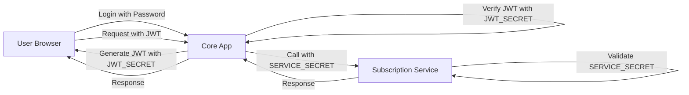

# 🔐 Secrets Configuration Guide

## Overview
Your application uses two types of secrets for different security purposes:

1. **JWT_SECRET** - For user authentication tokens
2. **SERVICE_SECRET** - For internal microservice communication

---

## 🔑 JWT_SECRET

### Purpose
- Signs and verifies JWT tokens for **user authentication**
- Used when users log in to create their session tokens
- Validates user requests to protected API endpoints
- Ensures tokens haven't been tampered with

### Where It's Used
- User login/registration (token generation)
- API request authentication (token validation)
- Session management
- Cross-service user authentication

### Example Usage in Code
```javascript
// Token generation (login)
const token = jwt.sign(
  { userId, email, firstName, lastName },
  process.env.JWT_SECRET,
  { expiresIn: '24h' }
);

// Token validation (middleware)
const decoded = jwt.verify(token, process.env.JWT_SECRET);
```

---

## 🔐 SERVICE_SECRET

### Purpose
- Authenticates **service-to-service** communication
- Ensures only your internal microservices can talk to each other
- Prevents external services from accessing internal APIs
- Different from user authentication - this is for backend services only

### Where It's Used
- Core app calling subscription service
- Core app calling AI modules
- Analytics service calling database service
- Any internal microservice communication

### Example Usage in Code
```javascript
// Service making request
const response = await fetch('http://subscription-service/api/internal/data', {
  headers: {
    'X-Service-Token': process.env.SERVICE_SECRET
  }
});

// Service validating request
if (req.headers['x-service-token'] !== process.env.SERVICE_SECRET) {
  return res.status(403).json({ error: 'Invalid service token' });
}
```

---

## 🎲 How to Generate Secure Secrets

### Method 1: Using Node.js (Recommended)
```bash
# Open Node.js REPL
node

# Generate a secure random string
require('crypto').randomBytes(64).toString('hex')

# Example output:
# 'a7f3d2b8e9c4f6a1d5e8b3c7f2a9d4e6b1c8f5a2d7e3b9c6f4a1d8e5b2c9f7a3d6e4b1c8f5a2d7e3b9c6f4a1'
```

### Method 2: Using OpenSSL
```bash
# Generate 64 random bytes and encode as hex
openssl rand -hex 64
```

### Method 3: Using PowerShell
```powershell
# Generate secure random string
-join ((1..64) | ForEach {'{0:X}' -f (Get-Random -Max 256)})
```

### Method 4: Online Generator (Less Secure)
Use a password generator to create a 64+ character random string with:
- Uppercase letters
- Lowercase letters  
- Numbers
- Special characters

---

## 📁 Where to Put Each Secret

### Core App (`ai2-core-app/.env`)
```env
# User authentication
JWT_SECRET=your_generated_64_char_hex_string_here

# Service-to-service authentication
SERVICE_SECRET=different_generated_64_char_hex_string_here

# Example (DO NOT USE THESE - GENERATE YOUR OWN):
JWT_SECRET=a7f3d2b8e9c4f6a1d5e8b3c7f2a9d4e6b1c8f5a2d7e3b9c6f4a1d8e5b2c9f7a3
SERVICE_SECRET=b8e4c3a9f7d2e6b1c5f8a3d6e9b2c7f4a1d8e5b3c9f6a2d7e4b1c8f5a3d9e6b2
```

### Subscription Service (`ai2-subscription-service/.env`)
```env
# Same JWT secret for validating user tokens
JWT_SECRET=same_jwt_secret_as_core_app

# Same service secret for internal communication
SERVICE_SECRET=same_service_secret_as_core_app
```

### AI Modules (`ai2-core-app/external/ai-modules/.env`)
```env
JWT_SECRET=same_jwt_secret_as_core_app
SERVICE_SECRET=same_service_secret_as_core_app
```

### Analytics Service (`ai2-analytics/.env`)
```env
JWT_SECRET=same_jwt_secret_as_core_app
SERVICE_SECRET=same_service_secret_as_core_app
```

### Connectors Service (`ai2-connectors/.env`)
```env
JWT_SECRET=same_jwt_secret_as_core_app
SERVICE_SECRET=same_service_secret_as_core_app
```

### Notifications Service (`ai2-notifications/.env`)
```env
JWT_SECRET=same_jwt_secret_as_core_app
SERVICE_SECRET=same_service_secret_as_core_app
```

---

## ⚠️ IMPORTANT RULES

### DO's ✅
1. **Use the SAME JWT_SECRET** across all services
2. **Use the SAME SERVICE_SECRET** across all services
3. **Generate long, random secrets** (minimum 32 characters, recommended 64+)
4. **Store in .env files** that are gitignored
5. **Rotate secrets periodically** in production
6. **Use different secrets** for different environments (dev/staging/prod)

### DON'Ts ❌
1. **Never commit secrets** to Git
2. **Never use default/example secrets** in production
3. **Never share secrets** in logs or error messages
4. **Never use simple/guessable strings**
5. **Never mix up** JWT_SECRET and SERVICE_SECRET

---

## 🚀 Quick Setup Commands

### Step 1: Generate Both Secrets
```bash
# Generate JWT_SECRET
node -e "console.log('JWT_SECRET=' + require('crypto').randomBytes(64).toString('hex'))"

# Generate SERVICE_SECRET  
node -e "console.log('SERVICE_SECRET=' + require('crypto').randomBytes(64).toString('hex'))"
```

### Step 2: Add to All Service .env Files
Copy the generated values to each service's `.env` file:

```bash
# List of services that need the secrets
- ai2-core-app/.env
- ai2-subscription-service/.env
- ai2-core-app/external/ai-modules/.env
- ai2-analytics/.env
- ai2-connectors/.env
- ai2-notifications/.env
```

### Step 3: Restart All Services
```bash
# Restart services to load new environment variables
npm run restart:all
```

---

## 🔍 How They Work Together



1. **User logs in** → Core app creates JWT signed with `JWT_SECRET`
2. **User makes request** → Includes JWT in Authorization header
3. **Core app validates** → Verifies JWT with `JWT_SECRET`
4. **Core needs subscription data** → Calls subscription service with `SERVICE_SECRET`
5. **Subscription service validates** → Checks `SERVICE_SECRET` matches
6. **Response flows back** → Through core app to user

---

## 🔒 Security Best Practices

### For JWT_SECRET
- **Length**: Minimum 256 bits (32 bytes / 64 hex characters)
- **Rotation**: Every 3-6 months in production
- **Algorithm**: Use HS256 or RS256 for signing
- **Expiration**: Set reasonable token expiration (24h for web apps)

### For SERVICE_SECRET  
- **Length**: Minimum 256 bits (32 bytes / 64 hex characters)
- **Transport**: Always use HTTPS in production
- **Header**: Use custom header like `X-Service-Token`
- **Validation**: Check on every internal API call

### Environment-Specific Secrets
```env
# Development
JWT_SECRET=dev_jwt_secret_not_for_production
SERVICE_SECRET=dev_service_secret_not_for_production

# Staging
JWT_SECRET=staging_jwt_secret_different_from_dev
SERVICE_SECRET=staging_service_secret_different_from_dev

# Production
JWT_SECRET=prod_ultra_secure_randomly_generated_secret
SERVICE_SECRET=prod_ultra_secure_randomly_generated_service_secret
```

---

## 📊 Summary Table

| Secret | Purpose | Used By | Must Match Across Services |
|--------|---------|---------|---------------------------|
| JWT_SECRET | User authentication | All services | ✅ Yes |
| SERVICE_SECRET | Service-to-service auth | All services | ✅ Yes |
| OIDC Secrets | Zitadel integration | Core app only | ❌ No |
| Database passwords | DB connections | Each service | ❌ No |

---

## 🚨 Troubleshooting

### "Invalid token" errors
- Check JWT_SECRET is same across all services
- Verify token hasn't expired
- Ensure Bearer prefix in Authorization header

### "Service authentication failed"
- Check SERVICE_SECRET is same across all services
- Verify X-Service-Token header is sent
- Ensure service is using correct header name

### Services can't communicate
- Verify both services have same SERVICE_SECRET
- Check network connectivity between services
- Ensure proper error handling for service calls

---

**Remember**: These secrets are the keys to your kingdom. Generate them securely, store them safely, and never expose them publicly! 🔐
